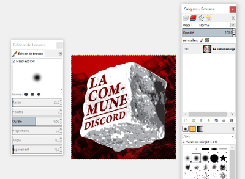
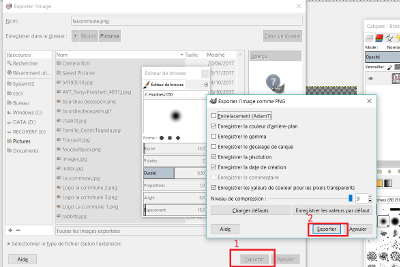

# Comment créer une émote avec un fond transparent ?

Prenons par exemple le logo de La Commune. Imaginons que vous vouliez créer une émote reprenant le cube avec le texte, sans le fond rouge.

Vous avez cette image : 

Et vous voudriez obtenir celle-ci : 

Pour cela, il faut faire disparaitre le fond rouge de l'image. Ce guide vous explique la démarche à suivre.

Ce guide fonctionne pour les émotes créées sous Gimp. Si vous n'avez pas ce logiciel, vous pouvez le trouver [ici](https://www.gimp.org/fr).

## Étape 1 : préparation de l'image

Ouvrir l'image avec Gimp 

Vous obtenez ceci : 

Faire clique droit sur calque > transparence > ajouter un canal alpha. L'image est maintenant prête pour être détourée.

## Étape 2 : détourage

Cette étape est celle du détourage, dans laquelle vous allez sélectionner l'image à séparer du fond. 

Pour cela, allez dans outils > outils de sélection > sélection à main levée

Pour plus de confort et de précision, vous pouvez zoomer sur l'image. Vous pouvez ne sélectionner qu'une seule partie du fond et travailler en plusieurs étapes.
Pensez à bien fermer le contour à la fin.

## Étape 3 : suppression du fond

Maintenant que le fond (ou une partie du fond si vous travaillez en plusieurs étapes) est sélectionnée, il faut le supprimer. Pour cela, deux situations sont possibles :

  * si c'est l'objet de l'image qui est sélectionné, aller dans sélection > inverser, afin de sélectionner le fond.
  * si c'est le fond qui est sélectionné, il n'y a rien à faire
  
Une fois le fond sélectionné, faire Ctrl + x. Le fond disparaît.

Puis sélection > aucun pour désélectionner l'image

Ensuite, il faut enlever le plus de fond transparent possible, pour ne garder que l'image qui nous intéresse. 

Pour cela : Outils > outils de sélection > sélection rectangulaire pour sélectionner l'image, puis Image > Rogner selon la sélection. 

## Étape 4 : enregistrement du résultat
Vous obtenez votre image, avec un fond transparent, prête à être sauvegardée pour devenir une émote. Il vous faut l'enregistrer avec l'extension .png.

Pour cela : Fichier > exporter sous 

Nommez votre fichier avec l'extension .png : le_nom.png . Dans notre exemple, notre emote s'appelle Lacommune.png

Cliquez sur « export ». Une fenêtre apparaît, cliquez de nouveau sur « export »

C'est terminé, votre image est prête à être ajoutée aux autres émotes du serveur.

